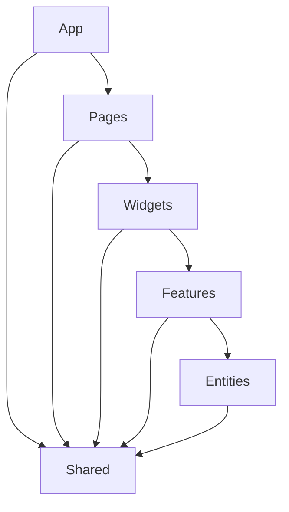

# FSD Calculator(WIP)

This project is a calculator application built using the Feature Sliced Design (FSD) architecture. It demonstrates how to structure a React application using FSD principles, with React, TypeScript, Vite, Vitest, and shadcn/ui.

## Project Structure

The project follows the FSD architecture, which organizes code into layers:



- `app`: Application-wide settings and providers
- `pages`: Page components that compose widgets and features
- `widgets`: Complex UI components composed of features and entities
- `features`: User interactions and business logic
- `entities`: Business entities and their operations
- `shared`: Reusable components, utilities, and types

## Getting Started

1. Clone the repository
2. Install dependencies:
   ```
   pnpm install
   ```
3. Run the development server:
   ```
   pnpm dev
   ```
4. Open [http://localhost:5173](http://localhost:5173) in your browser

## Technologies Used

- React
- TypeScript
- Vite
- Vitest
- shadcn/ui
- Tailwind CSS

## Contributing

Contributions are welcome! Please feel free to submit a Pull Request.

## License

This project is open source and available under the [MIT License](LICENSE).